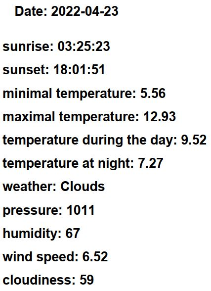

# Project Name
> Final Project - Weather generator for the selected city.
## Table of Contents
* [General Info](#general-information)
* [Technologies Used](#technologies-used)
* [Features](#features)
* [Screenshots](#screenshots)
* [Setup](#setup)
* [Usage](#usage)
* [Project Status](#project-status)
* [Room for Improvement](#room-for-improvement)
* [Acknowledgements](#acknowledgements)
* [Contact](#contact)
<!-- * [License](#license) -->
## General Information
The program displays the weather forecast in Gdańsk based on the "Open weather map" api for the selected day.

The user provides the date (in a specific format) for which he wants to obtain weather data for the place he has chosen (e.g. for Gdańsk).

--

- The program gets the data using api.

- Using the imported "fpdf" library, we save the obtained data to a "PDF" type file.

- We control whether the given date for which we are to obtain weather data has been entered in the correct format.

<!-- You don't have to answer all the questions - just the ones relevant to your project. -->
## Technologies Used
- Python - version 3.10.2
## Features
List the ready features here:
- Generating the weather forecast from your own computer.
- Ability to send generated data using common format (* .PDF)

## Screenshots

<!-- If you have screenshots you'd like to share, include them here. -->
## Setup
The program runs on the base:

- PyCharm application library

- Requests library

- Json library 

- Geopy library

- Fpdf library

## Usage
How does one go about using it?

    number_of_days = day_calculator.diff_dates()
    days = []
    days = day_temp.main(number_of_days)

    pdf_file = FPDF()

    for day in days:
        print_day.print_day(pdf_file,day)
    pdf_file.output('Weather_data.pdf', 'F')
## Project Status
Project is:  _beginning of program development_ . 

## Room for Improvement

-   Selection of other cities for which we will generate data.

-  Obtaining weather data from various databases / portals.

- Only specific / specific parameters related to the weather can be selected (e.g. maximum temperature, minimum temperature, air humidity).

- Compare the results obtained from different sides - this will allow you to create a more reliable forecast.

- Graphical representation of the obtained data. (data clearer for recipients).

## Acknowledgements
Give credit here.

- This project was based on book : "Python dla każdego Podstawy programowania" Michael Dawson.
- This project was based on book : "Python. Zadania z programowania. Przykładowe imperatywne rozwiązania"
Kubiak Mirosław J.

- Many thanks to PawełP.

## Contact
Created by PawełP & Maciej Cieszynski - feel free to contact us!

<!-- Optional -->